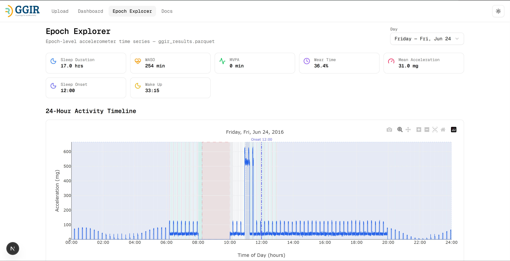

# GGIR Explorer

[](https://opensource.org/licenses/MIT)
[](https://doi.org/10.5281/zenodo.19154830)
[Live App](https://ggir-web-dashboard.vercel.app/) · [Docs](https://ggir-web-dashboard.vercel.app/docs) · [Citation](./CITATION.CFF) · [License](./LICENSE)

GGIR Explorer is a browser-based dashboard for accelerometry visualization and exploration of GGIR parquet output locally using DuckDB-Wasm. It is designed to help researchers inspect uploaded wearable research data, review schema and metadata, analyze day-level sleep and physical activity summaries, and drill down into epoch-level behavior when nested epoch data is available.



## Why this project exists

GGIR produces rich outputs, but many workflows still rely on static tables, reports, or custom scripts to inspect them. GGIR Explorer provides an interactive accelerometry visualization layer on top of those outputs so researchers can audit data quality, understand participant behavior over time, and explore high-resolution wearable accelerometer data without setting up a backend service.

## Key Features

- Browser-side analysis using DuckDB-Wasm and Apache Parquet
- Drag-and-drop parquet upload with schema, metadata, and raw data preview
- Day-level dashboard views for validity, sleep, and physical activity
- Epoch Explorer for 24-hour timelines, class distributions, acceleration views, MVPA accumulation, and multi-day summaries
- Automatic support for optional epoch signals such as `lux`, `anglez`, and `temperature` when present
- Built-in documentation for GGIR parquet export and data model usage

## Quick Start

### 1. Generate parquet output in GGIR

Ensure the `arrow` R package is installed. Enable parquet export by setting `save_dashboard_parquet = TRUE`. All five parts (1–5) and reports for parts 2, 4, and 5 must run for the export to produce meaningful output.

```r
library(GGIR)
GGIR(
  mode = 1:5,
  datadir = "/path/to/raw/data",
  outputdir = "/path/to/output",
  do.report = c(2, 4, 5),
  save_dashboard_parquet = TRUE
)
```

The parquet file is created at `<outputdir>/output_<studyname>/results/ggir_results.parquet`. For more options and troubleshooting, see the [Docs](https://ggir-web-dashboard.vercel.app/docs) page.

### 2. Open the hosted app

1. Go to [https://ggir-web-dashboard.vercel.app/](https://ggir-web-dashboard.vercel.app/).
2. Upload your GGIR parquet file.
3. Explore the dashboard, epoch explorer, and built-in docs.

## What You Can Explore

- **Upload page**: inspect parquet rows, schema, and key-value metadata after upload
- **Dashboard**: review validity summaries, participant/day filters, sleep analysis, and physical activity analysis
- **Epoch Explorer**: inspect 24-hour timelines, activity class distributions, acceleration distributions, class-by-hour views, MVPA accumulation, multi-day heatmaps, and non-wear patterns
- **Secondary signals**: view `anglez`, `lux`, and `temperature` when those optional epoch fields are present
- **Docs**: follow export instructions, review the data model, and check troubleshooting guidance

## Project Pages

| Route | Purpose |
| --- | --- |
| `/` | Upload parquet files and preview schema, metadata, and tabular data |
| `/visualization` | Main day-level dashboard for sleep and physical activity |
| `/epoch-explorer` | Epoch-level exploration for participants and dates |
| `/docs` | Documentation for parquet export, schema, and usage |

## Requirements

- A modern browser with WebAssembly support (e.g. Chrome, Firefox, Edge, Safari)
- GGIR output exported as parquet
- The `arrow` R package in your GGIR environment

For the expected parquet structure, see [GGIR_DATA_MODEL.md](./GGIR_DATA_MODEL.md).

## Data Notes

- The app expects GGIR parquet output from wearable accelerometer studies and reads both top-level summary columns and nested epoch data.
- Behavioral class labels may come from parquet metadata via the `behavioral_codes` key.
- Some files include optional epoch-level fields such as `lux`, `anglez`, or `temperature`, which the app will visualize automatically when available.
- The Epoch Explorer requires a nested `epochs` column. If that column is missing, the dashboard can still be used for day-level exploration.

## Known Limitations

- The upload-page tabular preview currently reads up to the first 10,000 rows from the parquet file.
- The Epoch Explorer depends on nested epoch data and may not be available for summary-only parquet files.
- Very large epoch-heavy recordings can increase browser memory usage and reduce responsiveness.
- The first use still depends on downloading DuckDB-Wasm assets before analysis can happen in-browser.
- Browser-side processing helps keep uploaded data local to the app session, but this README should not be interpreted as a legal or regulatory compliance guarantee by itself.


## Local Development (Optional)

Local setup is only needed if you want to contribute or run the app yourself.

### Prerequisites

- Node.js 18+
- npm

### Run locally

```bash
git clone https://github.com/samuelafolabi/ggir-web-dashboard.git
cd ggir-web-dashboard
npm install
npm run dev
```

Then open [http://localhost:3000](http://localhost:3000).

### Other useful scripts

```bash
npm run build
npm start
npm run lint
```

## Tech Stack

- Next.js
- React
- DuckDB-Wasm
- Plotly.js
- Tailwind CSS
- Radix UI

## Contributing

Contributions are welcome from researchers, developers, and users with feature ideas or bug reports.

1. Fork the repository.
2. Create a feature branch: `git checkout -b feature/my-change`
3. Install dependencies and run the app locally.
4. Make your changes and run `npm run lint`.
5. Commit your work and open a pull request.

If you find a bug or want to request a feature, please open an issue in the GitHub repository.

## Citation

If you use this project in research, please cite it using the metadata in [CITATION.CFF](./CITATION.CFF).

## License

This project is distributed under the MIT License. See [LICENSE](./LICENSE) for details.

## Support

- Use GitHub Issues for bug reports and feature requests
- Use the hosted [Docs](https://ggir-web-dashboard.vercel.app/docs) page for export instructions and troubleshooting

## Acknowledgments

- [GGIR](https://cran.r-project.org/package=GGIR)
- [DuckDB-Wasm](https://duckdb.org/docs/api/wasm/overview)
- [Next.js](https://nextjs.org/)
- [Plotly.js](https://plotly.com/javascript/)
